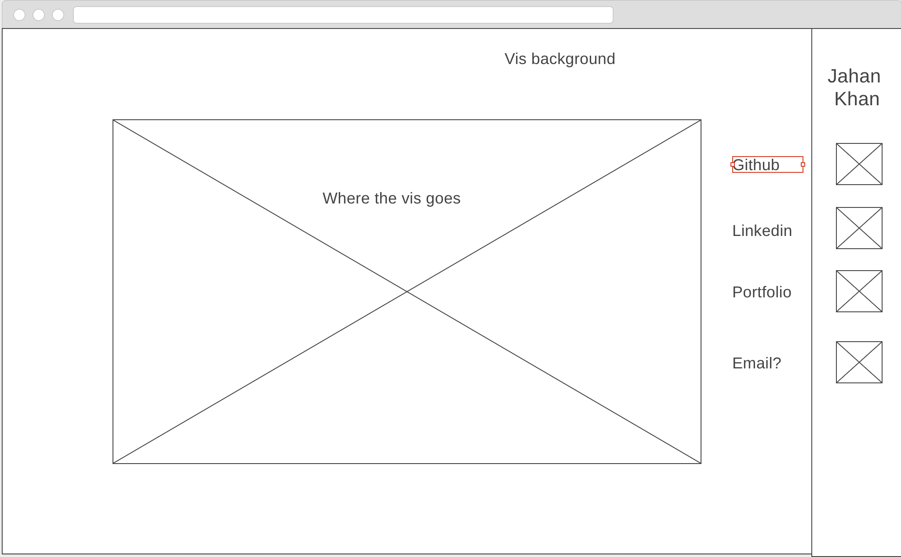

# Background:
 We know many ways to search one and two dimensional ranges to get inclusive points and nearest neighbors. This problem gets a bit harder when trying to visualize in three or more dimensions as a regular binary search tree or array will not suffice. Creating a K-d tree is great way of efficiently searching for k-dimensional ranges without the need for extra data structures.

# Functionality and MVP:
Create and rebalance kd-tree if necessary
Search for k nearest neighbors to a k-dimension point
Search for points within k dimensional hyperplane
Make visualization for 2 and 3 dimension kd-trees

# Wireframe:

# Technologies:
Vanilla JS and maybe lodash for some math functions
Canvas for 2d rendering
3js for 3d rendering
Webpack to bundle the goods

# Implementation Timeline:

Day 1: Create static KD Tree and KNN implementation

Day 2: Create 2-d vis of kd-tree and search algorithm

Day 3: Create 3-d vis of kd-Tree and search algorithm

Day 4: Finish 3-d vis of kd-tree and search algo
